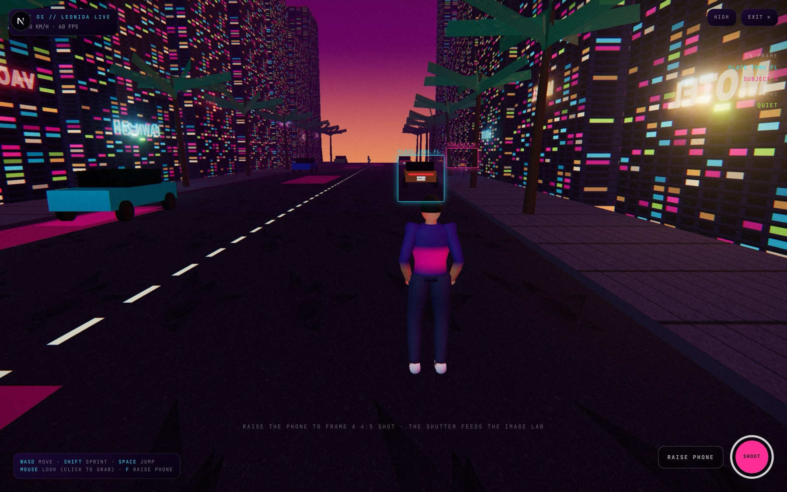
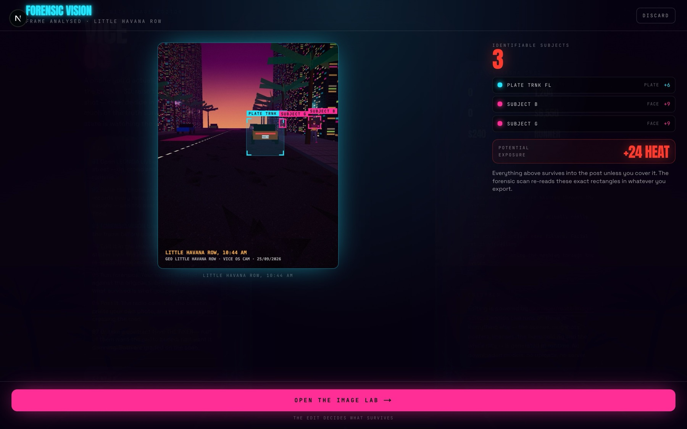
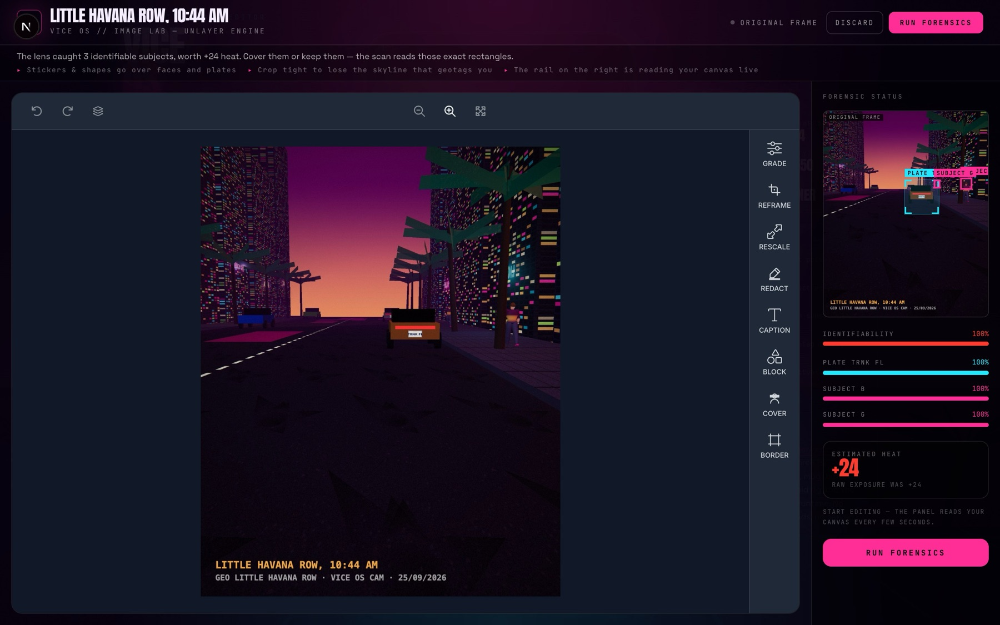
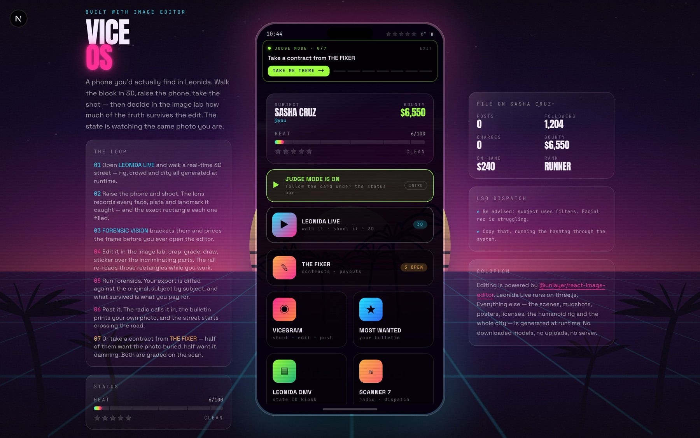
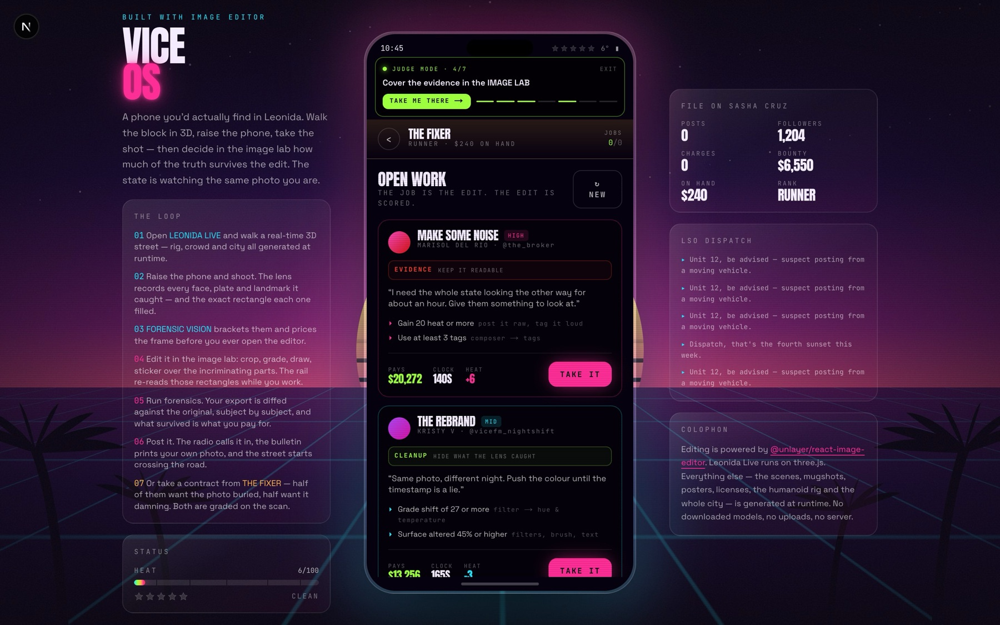
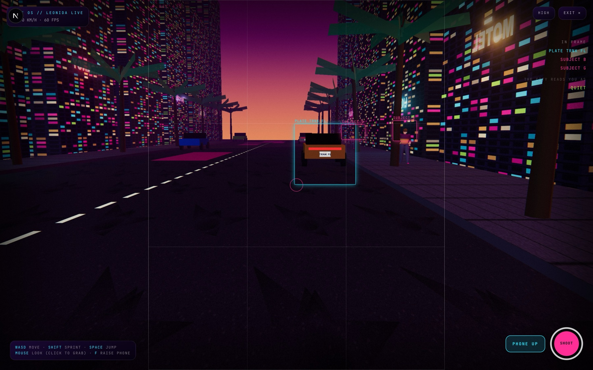
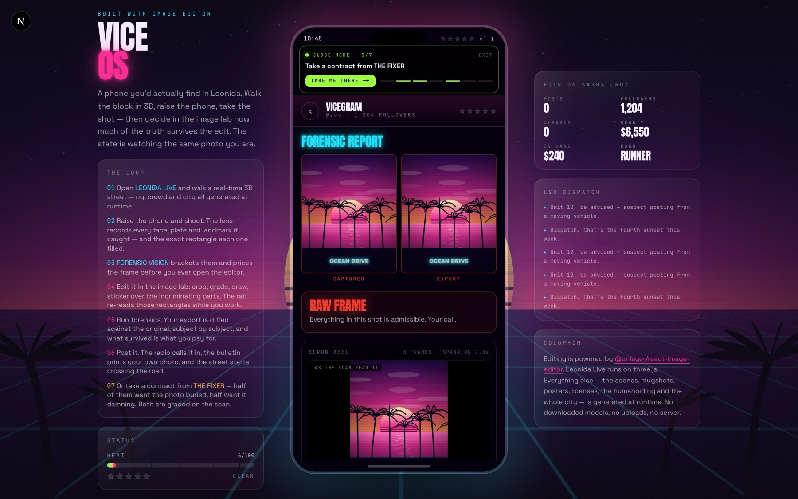
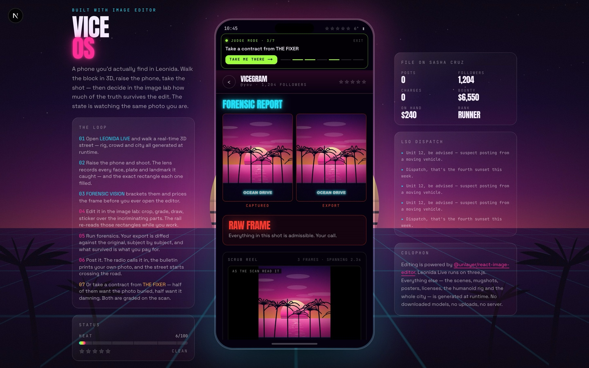
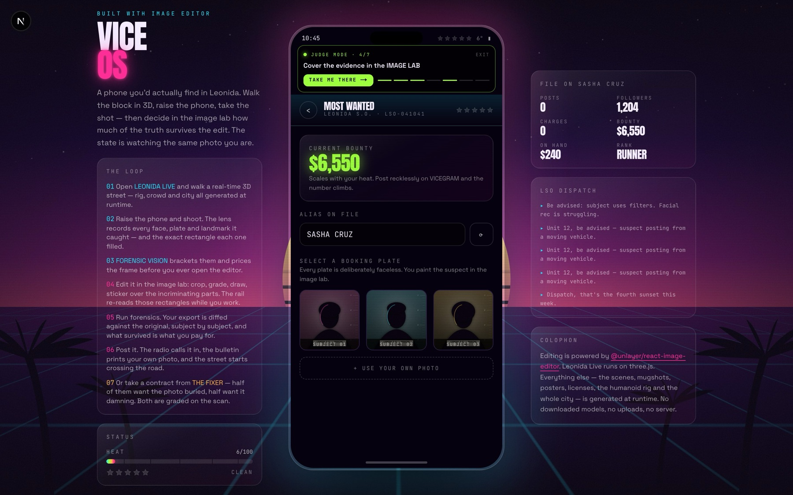

<div align="center">



# VICE OS — Leonida Live

**An in-world smartphone for a GTA VI–style Leonida, where the
[Unlayer React Image Editor](https://github.com/unlayer/react-image-editor) *is* the
forensic darkroom — and the photos you take into it are ones you went out and shot
yourself, in 3D.**

Built for the *Build with React Image Editor* challenge · `#BuiltWithImageEditor`


### [►&nbsp; PLAY IT IN YOUR BROWSER](https://sanganiharsh786.github.io/VICE_OS/)

<sub>No install, no sign-in, no server. Desktop keyboard and mouse, or touch on a phone.</sub>

[Play now](https://sanganiharsh786.github.io/VICE_OS/) ·
[The one idea](#the-one-idea-nobody-else-is-doing) ·
[How the editor is wired in](#how-the-react-image-editor-is-used) ·
[The scrub reel](#the-scrub-reel) ·
[Forensics](#forensics-reading-the-edit) ·
[Run it](#run-it)

</div>

---

## The one idea nobody else is doing

Most entries mount the editor, take `getImage()`, and **display** the result — on a wall, in
a feed, as a download. The picture is the prize.

VICE OS **measures** it. Every export is diffed against the frame the camera produced, region
by region, and that measurement is the only thing the game scores. Nothing in this project is
narrative dressing on top of an editor; the heat you take, the cash a contract pays, the line
the police radio reads out and the photo the state prints on your own wanted poster are all
functions of a pixel diff.

> **Cover the face and your heat drops. Leave it and the bulletin has your face on it.**
> The editor is not how you decorate the game. It is how you play it.

<table>
  <tr>
    <td width="33%"></td>
    <td width="33%"></td>
    <td width="33%"></td>
  </tr>
  <tr>
    <td align="center"><b>01 · Shoot it</b><br><sub>A real 3D block, in real time</sub></td>
    <td align="center"><b>02 · Get the bill</b><br><sub>Every subject the lens caught, priced</sub></td>
    <td align="center"><b>03 · Scrub it</b><br><sub>The rail re-reads your canvas as you work</sub></td>
  </tr>
</table>

## The loop

You're holding a phone that belongs to someone with a growing problem. Everything you post to
**VICEGRAM** raises your **heat** — and heat drives your wanted stars, your bounty, the police
chatter on the scanner and the red-and-blue strobing at the edge of the screen. Before anything
is published, a forensic pass diffs your export against the original frame and scores how
identifiable it still is.

```
LEONIDA LIVE  →  FORENSIC VISION  →  IMAGE LAB  →  FORENSIC REPORT  →  CONSEQUENCES
walk · shoot     brackets + prices    cover it     before / after       radio · bulletin
                 what the lens        crop it      scrub score          heat · stars
                 caught, per box      grade it     heat breakdown       bounty · contract
```

Take the same photograph twice, edit it two different ways, and you get two different cities to
walk back into. That is the whole pitch.

## Six apps, four of them built on the editor

<table>
  <tr>
    <td width="50%"></td>
    <td width="50%"></td>
  </tr>
  <tr>
    <td align="center"><b>The phone</b><br><sub>Heat, stars and bounty, all downstream of the scan</sub></td>
    <td align="center"><b>THE FIXER</b><br><sub>Half want the photo buried, half want it damning</sub></td>
  </tr>
</table>

| App | What you edit | What comes out |
| --- | --- | --- |
| **LEONIDA LIVE** | — | A real-time 3D block you walk in third person. The shutter renders a 1080×1350 frame **plus the rectangle every identifiable subject filled**, then runs FORENSIC VISION on it |
| **THE FIXER** | — | Timed contracts in two opposing categories, scored **entirely on the forensic scan of your export**: payouts, heat swings, a rank and a ledger |
| **VICEGRAM** | A frame you shot in 3D, a procedurally painted scene, or your own photo | A before/after forensic report, an itemised heat bill, a post, and an aftermath that plays out across the other apps |
| **MOST WANTED** | A blank booking plate — or **a photo you already published**, pulled from the state's evidence file | A composited WANTED bulletin with your live bounty, rap sheet and stars, downloadable as PNG |
| **LEONIDA DMV** | Your license portrait | A holographic state ID card with guilloche print, ghost portrait and a generated signature, downloadable as PNG |
| **SCANNER 7** | — | Radio + LSO dispatch whose chatter rate scales with your heat — and which calls **your own posts** in by name, with a line written from what the scan actually found |

## LEONIDA LIVE: the frames are yours now

The camera roll used to be the only source of images. Now there's a street.

**LEONIDA LIVE** is a real-time WebGL scene — a block of Leonida at golden hour, rendered
with three.js — that you walk in third person. Press `F` (or **RAISE PHONE**) and the
camera drops into the phone: first person, 4:5 viewfinder, thirds grid. Press the shutter
and the engine re-renders the frame at **1080×1350**, develops it with a film pass and a
geotag stamp, and hands it straight to the Image Lab.



### The part that makes it gameplay, not a tech demo

The world keeps an **evidence register** — every pedestrian's head, every parked car's
plate, the neon crown on Leonida Tower. At the instant the shutter fires, each tag is
projected into the capture camera's frustum and then ray-tested for occlusion, so the
photo comes with a list of exactly what was visible and identifiable:

> *The lens caught 3 identifiable subjects: PLATE TRNK FL, SUBJECT B, SUBJECT C. Whatever
> you leave in stays in.*

That list becomes the editor's brief, and it is **priced**: a face is worth 9 heat, a plate
6, the tower 5 — discounted by your scrub rating. So the composer can tell you
`+22 HEAT · Still identifiable. Go back to the lab and cover it.` The 3D mode's only job
is to give the image editor something real to be about.

### Realistic movement, solved rather than animated

There is **no rigged model, no `.glb`, no Blender, no animation clips.** The character is
built and animated from numbers at runtime, like everything else in this repo
([`src/lib/three/rig.ts`](src/lib/three/rig.ts),
[`src/lib/three/locomotion.ts`](src/lib/three/locomotion.ts)):

- **The rig** is a 21-bone hierarchy posed into a relaxed A-pose. Tapered tubes are then
  swept along the *posed* bone world transforms and every vertex is weighted against the
  bone segments it belongs to, so the mesh deforms properly at elbows and knees — and
  every animated rotation stays a small delta from bind, which is what stops shoulders
  from collapsing when the arms swing.
- **Stride length scales with speed** (1.6 m per cycle at a walk ≈ 115 steps/min, 3.2 m at
  a sprint ≈ 180), and gait frequency is derived as `speed / stride`. During stance the
  foot travels backward relative to the body at exactly the body's speed — so in world
  space it does not move. **No foot sliding, at any speed.**
- **Both legs and both arms run through an analytic two-bone IK solve**, with the knee and
  elbow placed explicitly from a pole vector. Limbs bend because of where they have to
  reach, not because a curve said so.
- **The pelvis** bobs twice per stride, sways toward the stance foot, and drops on the
  swing side (Trendelenburg gait); the shoulders counter-rotate against it.
- **Heel strike, foot flat and toe-off** are three separate ankle angles driven off the
  same gait phase, set in world space so the sole stays parallel to the road no matter how
  the leg ended up bent.
- **Arms lag the shoulders through a spring**, so they carry mass and overshoot; the elbow
  tightens as the pace builds.
- Turning banks the body, acceleration pitches it, landing compresses it, and standing
  still blends into breathing and a slow weight shift.

The same solver drives the player and the whole crowd. Pedestrians walk sidewalk
waypoints, watch you when you get close, and **break away and run once your heat passes
45** — which is exactly when you most want a photo of them.

### Everything else in the scene

Procedural buildings with painted window grids and flickering neon signage, palms, street
lamps, wet-asphalt neon smears, parked cars with readable plates, a landmark tower, and a
gradient sky with a sun sitting on the horizon down the street. Post chain is bloom →
tone map → a film pass with grain, vignette and chromatic aberration; at heat 50+ the
police strobe bleeds in at the edges of the lens.

Quality toggle, touch joystick + drag-look on mobile, pointer lock with a drag-look
fallback where the browser refuses it, and a clean failure card if WebGL is unavailable —
the rest of the phone still works without it.

## Contracts: the editor gets a scoreboard

A fixer wants a photo handled a specific way, and the only thing that decides whether you
delivered is what the forensic scan finds in your export
([`src/lib/contracts.ts`](src/lib/contracts.ts)):

> **THE CLEANER** — *"I don't care what it looks like when you're done. I care that nobody
> can match it to the frame it came from."* · Scrub rating 66% or higher · 150s · $9,850 · **-7 heat**

Contracts come in two categories that pull in **opposite directions**, and the board always
offers at least one of each:

> **CLEANUP** — *hide what the lens caught.* **THE GHOST FRAME**: every face, plate and
> landmark in the export unidentifiable · 240s · ~$27,000 · **-12 heat**

> **EVIDENCE** — *keep it readable.* **THE WITNESS**: a face still clearly identifiable,
> scrub rating 30% or lower · 210s · ~$29,000 · **+18 heat**

So the decision is never "cover everything". It's *"do I make this photo safer, or more
valuable?"* — and the answer is paid for in heat either way.

Thirteen job templates roll against your current heat, so the board is never impossible and
never free. Objectives map one-to-one onto editor tools — `coverage` wants stickers and shapes,
`grade shift` wants the filter panel, `reframe` wants crop or resize, `hideKind("FACE")` wants
a sticker on every bracket, and **GHOST POST** wants you to publish without moving the needle
a single degree.

- A live countdown rides under the status bar in **every** app, so you can feel the clock
  while you're inside the Image Lab.
- The composer shows the contract scorecard *before* you publish — `1/2 objectives met`,
  with "posting now blows the job" — so you can go back and keep editing.
- Delivering pays cash and usually cools you off; blowing it or running out the clock adds
  heat. Rank climbs RUNNER → EARNER → OPERATOR → FIXER → KINGPIN.
- **VANITY PRESS** settles against a printed bulletin instead of a post, so the contract
  system spans two of the three editor surfaces.

## How the React Image Editor is used

The editor is not a side panel. It's the **Image Lab** — a full-screen mode the phone breaks
out into, wearing the OS's own vocabulary
([`src/components/EditorStage.tsx`](src/components/EditorStage.tsx),
[`src/lib/editorConfig.ts`](src/lib/editorConfig.ts)).


### Every integration point, and what the game does with it

| Editor API | In VICE OS |
| --- | --- |
| `image` prop | A frame rendered by the 3D engine at the instant the shutter fired, a procedurally painted scene, or the player's own upload — never a hosted asset |
| `editor.getImage()` | Sampled every 1.4s to drive the live forensic rail **and** to film the scrub reel |
| `editor.hasChanges()` | Polled for `ORIGINAL FRAME` / `UNSAVED EDITS` in the chrome, and used as the gate that starts forensic sampling |
| `editor.reset(image)` | **START OVER** — puts the untouched capture back on the canvas without unmounting, so a second run at the same photograph keeps the warmed bundle, the tool rail and the zoom |
| `onSave({ dataUrl })` | The authoritative export. Both the editor's own save and the OS chrome's commit button route here, so there is exactly one export path |
| `onCancel` / `onLoadError` / `onError` | Wired; `Escape` discards, a dead CDN still lets the player out of the lab |
| `translations` | **~30 keys per surface.** Draw is `REDACT`, stickers are `COVER`, shapes are `BLOCK`, crop is `REFRAME`, grayscale is `Mono`, and the cancel dialog reads *"Leave the frame unscrubbed?"* |
| `features.imageEditor.tools.*.icon` | Three hand-drawn SVGs: a redaction marker for draw, a blackout bar over a face for stickers, a reticle for crop |
| `theme: "dark"`, `locale: "en"` | Matches the phone; options are memoised per surface so a re-render never re-applies mount options |
| CDN warm-up | The embed bundle is fetched during the ~2s boot sequence ([`warmUpEditor`](src/lib/editorConfig.ts)), so the first press of **EDIT** opens on a canvas instead of a spinner |

### One editor, three in-world machines

The same component mounts three times with three different vocabularies, so the tool reads
as three different pieces of state hardware rather than one component with a new header:

| | **FORENSIC DARKROOM** | **PRESS PLOTTER** | **DMV BOOTH** |
| --- | --- | --- | --- |
| Save | `RUN FORENSICS` | `SEND TO PRESS` | `ISSUE LICENSE` |
| Draw | `REDACT` | `SKETCH` | `RETOUCH` |
| Stickers | `COVER` | `FACE KIT` | `DISGUISE` |
| Crop | `REFRAME` | `TO PLATE` | `TO SPEC` |
| Filter | `GRADE` | `FLASH` | `LIGHTING` |
| Cancel | `DISCARD FRAME` | `PULL THE PLATE` | `VOID APPLICATION` |

### Small things that took the longest

- **One call to action.** Teaching the toolbar our words left `RUN FORENSICS` on screen twice.
  A polling pass marks the editor's own save/cancel pair by the labels our translations put
  there and one CSS rule hides them; the bar keeps step-back, step-forward, layers and zoom.
  The button still exists, because the commit path drives it.
- **Why commit goes through the editor's Save and not `getImage()`.** `getImage()` returns the
  working canvas *before* an active filter preset is baked in, so a grade-only edit would come
  back byte-identical to the original and the forensic diff would read 0%. `getImage()` is kept
  as a fallback so the player can never get stuck in the lab.
- **A live forensic rail.** The lab samples the working canvas, re-runs the region maths on it
  and shows identifiability draining per subject, an estimated heat, and an **edit history**
  named from the measurement itself (`SUBJECT B COVERED → 41%`) — the editor publishes no
  operation log, so rather than guess at tool names the panel reads the diff. It is labelled an
  estimate on purpose: the authoritative scan runs on the exported file.

Every export then goes somewhere real — a feed post, a Canvas-composited bulletin, a laminated
ID — instead of just being downloaded.

## The scrub reel

The forensic panel was already decoding the canvas every 1.4s to answer *how much of this is
still identifiable*. Those samples are kept, which means the lab has, for free, **a film of the
edit** — not of the brush strokes, but of the score falling.



The report plays it back as a flipbook you can scrub, and **SAVE THE REEL · VIDEO** films it
onto a 1280×720 canvas through `MediaRecorder` — title card, every sample with its meter, a
before/after wipe, the verdict — saving MP4 where the browser will write one and WebM where it
won't ([`src/lib/reel.ts`](src/lib/reel.ts)). Made locally, ready to post.

Two details keep it honest. The reel always **opens on the bare capture** and always **closes on
the exported file scored by the authoritative pass**, so the last frame is never the pre-filter
working canvas. And when it fills up it thins the middle rather than dropping the oldest frame,
because the before/after is the whole point.

## Forensics: reading the edit



Every number in this project is a measurement of two real images — the frame the camera
produced and the file the editor exported. Nothing is invented for the UI.

**Whole frame** ([`analyzeEdit()`](src/lib/art.ts)) normalises both to 128×128 and diffs them
pixel by pixel:

| Metric | Meaning |
| --- | --- |
| `altered` | % of pixels that moved meaningfully — grading, drawing, anything |
| `coverage` | % of pixels replaced outright — stickers, shapes, solid text |
| `temperature` | warm/cool shift your grade introduced |
| `reframed` | whether crop/resize changed the composition |

Those roll into a **scrub rating**. Aspect-ratio changes are handled, so cropping counts too.

**Per subject** ([`src/lib/forensics.ts`](src/lib/forensics.ts)) is what turns the edit into a
game. The engine records the rectangle each identifiable subject filled at the instant the
shutter fired, and the scan re-reads *those exact rectangles* in the export. Inside a box,
each pixel's channel delta is bucketed — over 150 means it was painted over (full credit),
over 48 means it moved far enough to defeat a matcher (partial credit) — and the mean is that
subject's **concealment**, 0–100, which maps to `VISIBLE / PARTIAL / HIDDEN / REMOVED`.

Two corrections keep that honest:

- **A frame-wide noise floor is subtracted from every region.** Exporting resamples and
  re-encodes the whole picture, and a global filter moves every pixel at once. That is a
  property of the frame, not of the subject — without the correction, one filter would read
  as though every face had been covered. What's left is change that happened *here and not
  everywhere*, which is exactly what covering a face is.
- **A reframed export skips the floor**, because the original coordinates no longer address
  the same content at all; the raw reading already answers the question the report asks,
  which is whether the subject is still recoverable from this file at this spot.

Heat is then itemised rather than asserted — `FACE +9 · PLATE +6 · TAGS +2 · PUBLISHING +6 ·
RAW EXPOSURE +41 · SCRUB DISCOUNT −30 · **FINAL HEAT +8**` — and the composer's projection and
the heat you actually take come from the same function, so the number you're shown is the
number you get.

## Everything is drawn at runtime

There is no stock art, no asset pipeline, no downloaded model and nothing copyrighted in
this repo. Every photo, mugshot, poster and ID is painted with **Canvas 2D in the browser**
([`src/lib/art.ts`](src/lib/art.ts), [`src/lib/compose.ts`](src/lib/compose.ts)) from a
seeded RNG and a handful of shared primitives — synthwave sun, perspective grid, palms,
skyline, water glitter, film grain, chromatic aberration.



**So does the sound.** There is not one audio file in this repository
([`src/lib/audio.ts`](src/lib/audio.ts)). The shutter is two noise bursts through a band-pass
a few milliseconds apart — a mirror slap and a curtain, which is the whole difference between
a camera and a tap. The radio squelch is the same noise buffer through a narrow band. Heat
moving is a saw sweeping up when it costs you and down when you cool off, and the shell plays
it by watching the two numbers rather than teaching six systems to make a noise. Nothing is
created until the lock screen is tapped, because browsers won't allow it, and `♪` in the
status bar turns it all off.

**The 3D holds to the same rule.** The humanoid rig, its skinned surface, the city,
the asphalt, the window grids, the neon signs and the licence plates are all generated
from parameters and canvas textures at boot
([`src/lib/three/`](src/lib/three)) — which is also why there is nothing to download and
nothing to license.

Nothing you edit or upload leaves your browser. There is no backend.

## Stack

- **Next.js 16** (App Router, TypeScript, static export-friendly — one route, no server)
- **Tailwind CSS v4** with a Vice palette defined in `@theme`
- **[@unlayer/react-image-editor](https://github.com/unlayer/react-image-editor)** for all editing
- **three.js** (WebGL2, `EffectComposer` post chain) for Leonida Live — loaded through
  `next/dynamic` so it only ships when you open the camera
- Canvas 2D for generation and compositing, `MediaRecorder` for the scrub reel
- **Web Audio** for every sound — there are no audio files either
- `next/font` (Anton / Space Grotesk / JetBrains Mono), read back into canvas so the posters
  use the same typography as the UI

## Run it

```bash
npm install
npm run dev
```

Then open http://localhost:3000.

```bash
npm run build && npm start
```

### Deploying

Every push to `main` publishes to GitHub Pages
([`.github/workflows/deploy-pages.yml`](.github/workflows/deploy-pages.yml)). The build sets
`PAGES_BASE_PATH` to the repo's sub-path, which switches
[`next.config.ts`](next.config.ts) to a static export (`output: "export"`) under that prefix.
A plain `npm run build` with no such variable stays an ordinary server build.

There is nothing to deploy *to* — one route, no API, no database. Everything the player makes
lives in their own browser.

### The screenshots

Everything in `docs/media/` is a real frame of the running app, captured by playing it:

```bash
npm run capture
```

[`scripts/capture.mjs`](scripts/capture.mjs) drives the local dev server through the whole loop
— boot, street, shutter, forensic vision, the lab, the report — with the Chrome already on the
machine (`puppeteer-core`, nothing bundled). Change the UI, re-run it, and the README catches up.

## Try this first

**In a hurry?** First launch plays a four-card intro and then offers **JUDGE MODE** — a card
under the status bar that names the single next action and takes you there. It walks the
whole loop in about ninety seconds. You can re-open it any time from the home screen.

Otherwise:

1. Let it boot, tap to unlock, open **THE FIXER** and take a contract — the clock starts.
2. Open **LEONIDA LIVE**. `WASD` to walk, `Shift` to sprint, mouse to look. Get close to
   a pedestrian or a parked car and watch live brackets snap onto them.
3. Press `F` to raise the phone, frame the 4:5 shot, and hit the shutter.
4. **FORENSIC VISION** brackets every subject the lens caught and prices the frame —
   *3 IDENTIFIABLE SUBJECTS · POTENTIAL EXPOSURE +20 HEAT* — before you touch the editor.
5. The Image Lab opens with those rectangles on the rail. Sticker over the faces, crop out
   the tower, push the grade, and watch identifiability drain per subject as you work.
6. Hit **RUN FORENSICS**. The report puts the capture next to the export, calls each subject
   `VISIBLE → HIDDEN`, and itemises the heat. Hide every one and you get a **PERFECT SCRUB**.
7. Not there yet? **RETURN TO LAB** — or **PUBLISH ANYWAY** and take the consequences.
8. Publish, and watch the aftermath play out app by app: the post lands, **SCANNER 7** calls
   your photo in over the radio, and **MOST WANTED** files your own export as evidence
   against you with a match confidence.
9. **Now the good bit.** Go back to that same frame in the camera roll and edit it the other
   way. The report will show you both runs side by side: *same photo, different outcome.*
10. Open **MOST WANTED** and print a bulletin using the photo you edited. Sprint past a
    pedestrian at heat 40+ and they'll run from you.

## Project layout

```
src/
  app/            layout, page, icon, OG image, theme
  components/
    ViceOS.tsx      phone shell, boot / lock / home, desktop side panels
    EditorStage.tsx the Image Lab — the React Image Editor wrapper + forensic rail
    Onboarding.tsx  the four-card intro
    JudgeMode.tsx   guided walkthrough of the whole loop
    Backdrop.tsx    animated Leonida sunset
    ui.tsx          stars, heat meter, buttons, panels
    forensic/
      ForensicVision.tsx   post-shutter scan: brackets, subjects, exposure
      ForensicReport.tsx   before/after, verdict, heat breakdown, perfect scrub
      Consequences.tsx     the aftermath, played back one app at a time
      EvidenceBoxes.tsx    the scanning brackets, shared by every surface
      useLiveForensics.ts  live sampling of the editor canvas, edit history, reel
      ScrubReel.tsx        the reel as a flipbook, plus the video export
    apps/           Contracts, Vicegram, MostWanted, LeonidaID, Scanner,
                    StreetMode (the Leonida Live shell, HUD and shutter)
  lib/
    three/
      rig.ts        procedural humanoid — skeleton, skinned surface, weights
      locomotion.ts gait solver, two-bone IK, full-body procedural animation
      city.ts       the block, its canvas textures and the evidence register
      engine.ts     renderer, camera rig, crowd, post chain, photo capture
    audio.ts        every sound in the OS, synthesised — no audio files
    editorConfig.ts the editor's three vocabularies, tool icons, CDN warm-up
    reel.ts         the scrub reel, filmed to MP4/WebM via MediaRecorder
    art.ts          procedural scenes, booking plates, whole-frame diff
    evidence.ts     evidence kinds, their heat prices, their rectangles
    forensics.ts    per-subject scan, scrub score, heat breakdown, heat tiers
    compose.ts      WANTED bulletin + Leonida ID compositors
    contracts.ts    job templates, objectives, scoring, the two categories
    store.tsx       heat / stars / bounty / posts / contracts state
    copy.ts         all in-world writing
```

## Accessibility & notes

- `prefers-reduced-motion` disables the strobes, sweeps, grain and marquees — including
  the wanted-level strobe inside Leonida Live.
- Works on mobile — the phone fills the viewport, the Image Lab goes full-screen, and
  Leonida Live swaps to a touch joystick, drag-look and on-screen run/jump/shutter.
- Leonida Live has a HIGH/LOW quality toggle (shadows, antialiasing, bloom strength,
  crowd size, pixel ratio) and degrades to a readable failure card without WebGL.
- Heat, alias, charges, cash and your job record persist in `localStorage`; photos and the
  live contract stay in memory only, so the storage quota is never at risk.
- Names, places, characters and jokes are original. Nothing from Rockstar's assets is used
  or reproduced; this is an unofficial fan concept and is not affiliated with Rockstar Games.

## License

MIT.
